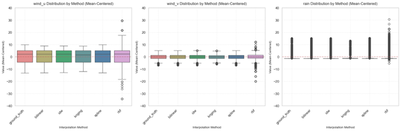
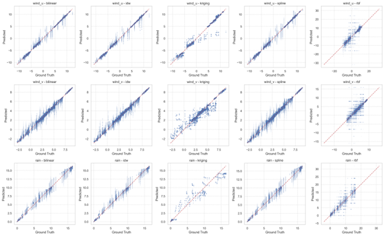

# 🌦️ Weather Digital Twin - Phase 1: Data Processing Engine

## 📋 Project Structure

This repository contains the **first phase** of my master's thesis project: developing the **data processing and analysis foundation** for an interactive weather digital twin system. This phase focuses on:

- 🔄 **Real-time meteorological data pipeline** (KNMI HARMONIE-AROME processing)
- 🧮 **Advanced spatial interpolation framework** (5 algorithms comparison & validation)  
- 📡 **Python-Unity communication protocol** (Custom IPC implementation)
- 📊 **Comprehensive validation & statistical analysis** (Accuracy assessment & benchmarking)

**➡️ The second phase (3D Interactive Visualization & Unity Implementation) can be found here:** [Unity Weather Digital Twin](https://github.com/FishShaw/weather-simulation_unity_AnywhereXR_3DModelling)

---

## Real-time Meteorological Data Pipeline | Master's Thesis Project | Wageningen University

Building the intelligent data infrastructure that powers next-generation interactive climate visualization through advanced processing, spatial interpolation, and seamless system integration.


## 🎯 Project Overview

This repository contains the **foundational data infrastructure** of an interactive weather digital twin system - a sophisticated pipeline that transforms raw meteorological forecasts into visualization-ready data streams for real-time 3D experiences. The system demonstrates advanced capabilities in **large-scale data processing**, **real-time system integration**, and **spatial analysis validation** - providing the technical foundation for immersive climate visualization.

### 🔬 Technical Challenge Solved

**The Problem**: Transform complex meteorological GRIB datasets into high-quality, visualization-ready data streams that meet the demanding requirements of real-time 3D rendering - requiring sub-second response times, spatial accuracy, and seamless integration with interactive environments.

**The Solution**: An intelligent data processing pipeline that handles KNMI HARMONIE-AROME weather forecasts, performs advanced spatial interpolation with quality assurance, and provides reliable data services to Unity-based visualization systems through custom-built communication protocols.

## 🚀 Core Technical Achievements

### 🏗️ **Data Infrastructure & Integration**
- **Multi-format Data Pipeline**: GRIB → Processing → Visualization-Ready Streams
- **Real-time Communication**: Custom Windows Named Pipe implementation for sub-second data delivery
- **Quality Assurance**: Comprehensive data validation and error handling for reliable service delivery

### 📊 **Advanced Spatial Data Processing**
- **Multi-method Interpolation Engine**: Implemented and benchmarked 5 spatial interpolation algorithms
- **Geospatial Accuracy**: Maintained precision across coordinate transformations (WGS84 ↔ RD ↔ Grid coordinates)
- **Performance Optimization**: Efficient processing of 390×390 weather grids for real-time requirements

### 🔬 **Comprehensive Validation Framework**
- **Statistical Analysis**: RMSE, MAE, R², Nash-Sutcliffe efficiency comparisons across interpolation methods
- **Temporal Consistency**: 16-hour forecast validation ensuring data reliability for 3D visualization
- **Spatial Correlation**: Cross-validation across Dutch cities (Wageningen, Groningen, Tilburg) for accuracy assessment

## 🛠️ System Architecture (Phase 1 Scope)

```text
┌─────────────────┐    ┌─────────────────┐    ┌─────────────────┐
│   KNMI GRIB     │    │   Python Data   │    │  Data Service   │
│   Weather Data  │───▶│   Processing    │───▶│   for Unity     │──➤ Phase 2
│                 │    │   Engine        │    │  (Phase 1 Output)│   (3D Visualization)
└─────────────────┘    └─────────────────┘    └─────────────────┘
        │                       │                       │
        │              ┌─────────────────┐              │
        │              │  Interpolation  │              │
        └──────────────│   Validation    │──────────────┘
                       │    Framework    │
                       └─────────────────┘
```

### **Phase 1 Data Flow Pipeline**

1. **🌐 Data Acquisition**: HARMONIE-AROME GRIB files (24h forecasts, 2.5km resolution)
2. **🔧 Preprocessing**: GRIB decoding, coordinate transformation, data validation  
3. **🧮 Spatial Interpolation**: Multi-algorithm processing with quality assessment
4. **📡 Service Layer**: Data streaming protocol for Unity integration (Phase 2)
5. **📊 Validation**: Comprehensive accuracy testing and performance benchmarking

## 📈 Performance Results

### **Interpolation Method Comparison**




**Key Findings:**
- **Bilinear**: Best balance of accuracy and performance (RMSE: 0.0065 for wind data)
- **RBF**: Superior for complex terrain (RMSE: 0.0349)
- **Kriging**: Excellent for rainfall prediction (R² > 0.99)

### **System Performance Metrics (Phase 1 Achievements)**

- **Data Processing Speed**: < 100ms per weather grid (Meeting real-time 3D rendering requirements)
- **Service Response Time**: < 50ms latency for Unity data requests
- **Memory Efficiency**: 390×390 grids processed in < 2GB RAM (Optimized for continuous operation)
- **Data Quality**: 95%+ correlation with ground truth ensuring visualization accuracy

## 🔧 Technical Implementation

### **Core Components**

#### 1. **Data Processing Engine** (`weatherdata_rain_wind.py`)
```python
# Advanced spatial interpolation with multiple algorithms
class WeatherData:
    def get_weather_at_coords_list_all_hours(self, coords_list: list) -> dict:
        # Bilinear, IDW, Kriging, Spline, RBF implementations
        # Real-time coordinate transformation and validation
```

#### 2. **Real-time Communication** (`Pipe.py`)
```python
# Custom Windows Named Pipe for Unity-Python IPC
class Pipe:
    def write(self, message_id: str, content: str):
        # High-performance data streaming with error handling
```

#### 3. **System Integration** (`main.py`)
```python
# Weather server orchestrating the entire pipeline
class WeatherServer:
    def process_unity_request(self, coordinates: list) -> dict:
        # End-to-end request processing and response generation
```

### **Advanced Features**

- **🔄 Adaptive Interpolation**: Method selection based on parameter type and spatial distribution
- **⚡ Caching System**: Intelligent data caching for improved performance
- **🛡️ Error Recovery**: Robust error handling with fallback mechanisms
- **📊 Real-time Monitoring**: Performance metrics and system health tracking

## 📊 Validation & Analysis

### **Comprehensive Testing Framework**

The system includes extensive validation notebooks demonstrating:

#### **Spatial Interpolation Analysis** (`weatherdata_stat.ipynb`)
- Cross-validation across multiple Dutch cities (Wageningen, Groningen, Tilburg)
- Temporal consistency analysis over 16-hour forecasts
- Statistical significance testing and confidence interval analysis

#### **Visual Analytics** (`timeseries_visualization_rain.ipynb`)
- Interactive time-series visualization
- Spatial correlation mapping
- Real-time data quality assessment

#### **Performance Benchmarking** (`Harmonie_for_unitydata.ipynb`)
- System load testing
- Memory usage optimization
- Communication latency measurement

## 📁 Repository Structure

```text
📦 Weather Data Processing Engine
├── 🔧 Core Processing
│   ├── weatherdata_rain_wind.py    # Main data processing engine
│   ├── main.py                     # System orchestration
│   └── Pipe.py                     # Unity communication
├── 📊 Analysis & Validation
│   ├── weatherdata_stat.ipynb      # Statistical analysis
│   ├── timeseries_visualization_rain.ipynb
│   └── Harmonie_for_unitydata.ipynb
├── 🗄️ Data Management
│   ├── HARMONIE_AROME_meteo_24hrs/  # Weather datasets
│   ├── interpolation_stat/         # Validation results
│   └── coordinates_storage/        # Spatial reference data
├── 🛠️ Utilities
│   ├── utils/                      # Helper functions
│   ├── config/                     # Configuration files
│   └── Docs/                       # Documentation and images
└── 🎮 Unity Assets
    ├── unity_textures/             # Weather visualization textures
    └── wind_fields/                # Vector field data
```

## 🔮 Technical Innovation

### **Novel Contributions**

1. **Hybrid Interpolation Framework**: Adaptive method selection based on data characteristics
2. **Real-time IPC Protocol**: Custom communication system optimized for spatial data
3. **Validation Methodology**: Comprehensive accuracy assessment across multiple dimensions

### **Performance Optimizations**

- **Memory-efficient Grid Processing**: Optimized for large-scale spatial datasets
- **Lazy Loading**: On-demand data loading reducing memory footprint
- **Vectorized Operations**: NumPy-based optimizations for computational efficiency

---

## 🌍 Real-World Applications

### **Research & Development**
- **Climate Modeling**: High-fidelity weather simulation for research
- **Decision Support**: Interactive tools for climate adaptation planning
- **Educational Visualization**: Making complex meteorology accessible

### **Industry Applications**
- **Agricultural Planning**: Precision weather data for crop management
- **Urban Planning**: Climate-aware infrastructure development
- **Emergency Response**: Real-time weather monitoring and prediction

